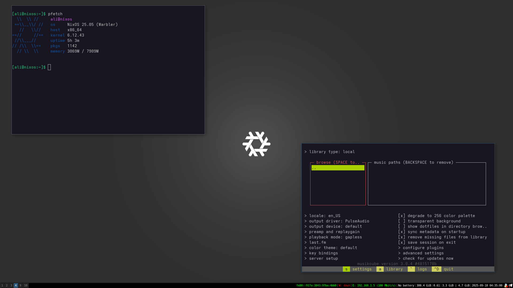

# My Personal NixOS Configuration
I'm trying to keep every configuration of my setup in this repository and allow everyone to use it.
I also appreciate any contributions, considerations, and suggestions!
It would be wonderful if everyone could (and maybe will) help me maintain and improve it.

Please help me create a better GNU/Linux system XD

# How to Use This Project
Just clone the project into an arbitrary directory and add its path to `/etc/configuration.nix`.
Here is my suggestion for installing my setup:

```bash
cd /etc
git clone https://github.com/alirezaarzehgar/mynixos

cat <<_EOF_ > /etc/nixos/configuration.nix 
{ ... }:

{
  imports = [
    ./hardware-configuration.nix
    /etc/mynixos/configuration.nix
  ];
  system.stateVersion = "25.05";
}
_EOF_
```

*NOTE*: Look at `config/i3/config` file if cloning repo in `etc` is not good for you.
Change wallpaper path in following line:

```plaintext
# config/i3/config
exec --no-startup-id feh --bg-scale /etc/mynixos/config/i3/wallpaper.png
```
